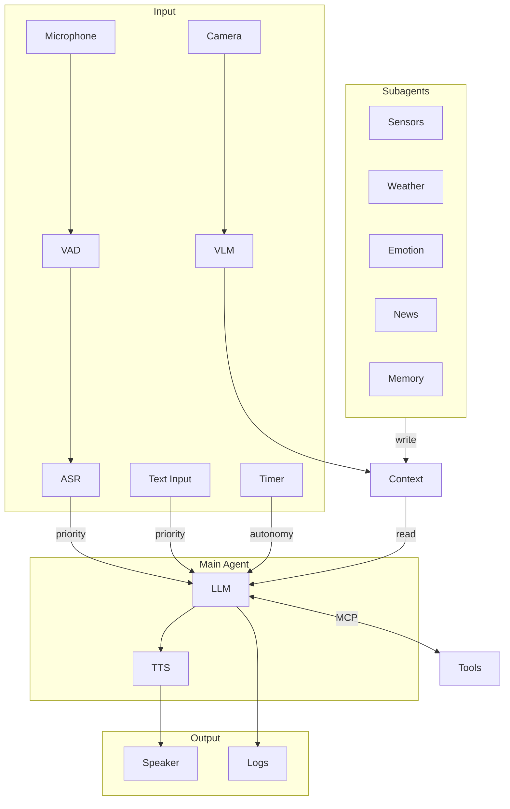

# GLaDOS Personality Core

> *"Science isn't about asking why. It's about asking, 'Why not?'"  -  Cave Johnson*

[Русская версия / Russian version](README.ru.md)

A fork of [dnhkng/GLaDOS](https://github.com/dnhkng/GLaDOS) with **Russian language support** — a voice AI assistant styled after GLaDOS from Portal. A sarcastic, passive-aggressive artificial intelligence that sees through a camera, hears through a microphone, speaks through a speaker, and judges you accordingly.

## What's added in this fork

- **Russian TTS** — Russian speech synthesis with GLaDOS voice via [TeraTTS](https://github.com/Tera2Space/TeraTTS) + [ruaccent](https://github.com/Den4ikAI/ruaccent) for proper stress placement
- **Russian config** — ready-to-use `configs/glados_config_ru.yaml` with Russian system prompt and few-shot examples in GLaDOS style
- **Optimized LLM** — configured for Qwen 2.5 7B which handles Russian well (unlike llama3.2)
- **Lazy ASR loading** — speech recognition model loads only on first unmute, speeding up startup
- **Better error handling** — ASR errors are logged with full traceback instead of silently killing the thread

## Quick Start

### 1. Install Ollama and pull a model

```bash
# Install Ollama: https://github.com/ollama/ollama
ollama pull qwen2.5:7b
```

### 2. Clone and install

```bash
git clone https://github.com/gotogrub/GLaDOS.git
cd GLaDOS
python scripts/install.py
uv pip install -e ".[cpu,ru]"
```

### 3. Download models

```bash
uv run glados download
```

### 4. Run

```bash
uv run glados tui --config configs/glados_config_ru.yaml
```

## Run modes

```bash
# Russian version (TUI)
uv run glados tui --config configs/glados_config_ru.yaml

# English version (original)
uv run glados tui

# Voice mode (English ASR)
uv run glados start

# Text only
uv run glados start --input-mode text --config configs/glados_config_ru.yaml

# Speak a phrase
uv run glados say "The cake is a lie"
```

## Configuration

Config files:
- `configs/glados_config.yaml` — English (original)
- `configs/glados_config_ru.yaml` — Russian

### Voices

Set `voice` in config:

| Value | Language | Description |
|-------|----------|-------------|
| `glados` | EN | Original GLaDOS voice |
| `glados_ru` | RU | Russian GLaDOS voice (TeraTTS) |
| `af_bella`, `am_adam`, ... | EN | Kokoro voices |

### Changing the LLM

```yaml
llm_model: "qwen2.5:7b"      # good Russian support
# llm_model: "gemma-3:4b"     # faster, decent Russian
# llm_model: "llama3.2"       # English only
```

Browse models: [ollama.com/library](https://ollama.com/library)

### ASR (Speech Recognition)

Built-in ASR (Parakeet TDT) supports **English only**. In the Russian config it starts deferred — loads on first enable via `/asr on` in TUI or Command Palette (`Ctrl+P`).

### Custom Personality

```yaml
personality_preprompt:
  - system: "You are a sarcastic AI who judges humans."
  - user: "What do you think of my code?"
  - assistant: "I've seen better output from a random number generator."
```

### MCP Servers

```yaml
mcp_servers:
  - name: "system_info"
    transport: "stdio"
    command: "python"
    args: ["-m", "glados.mcp.system_info_server"]
```

Built-in: `system_info`, `time_info`, `disk_info`, `network_info`, `process_info`, `power_info`, `memory`

Details: [docs/mcp.md](/docs/mcp.md)

## TUI Controls

| Shortcut | Action |
|----------|--------|
| `Ctrl+P` | Command palette |
| `F1` | Help |
| `Ctrl+D` | Dialog panel |
| `Ctrl+L` | Logs panel |
| `Ctrl+S` | Status panel |
| `Ctrl+A` | Autonomy panel |
| `Ctrl+U` | Queue panel |
| `Ctrl+M` | MCP panel |
| `Ctrl+I` | Toggle right panels |
| `Ctrl+R` | Restore all panels |

## Architecture



| Component | Technology | Purpose |
|-----------|------------|---------|
| ASR | Parakeet TDT (ONNX) | Speech recognition (EN) |
| VAD | Silero VAD (ONNX) | Voice activity detection |
| TTS (EN) | Kokoro / GLaDOS | English speech synthesis |
| TTS (RU) | TeraTTS + ruaccent | Russian speech synthesis |
| Vision | FastVLM (ONNX) | Scene understanding |
| LLM | OpenAI-compatible API | Reasoning, tool use |
| Tools | MCP Protocol | Extensibility |
| Memory | MCP + Subagent | Long-term memory |
| Emotions | PAD + HEXACO | Emotional state |

## Russian Language Dependencies

```bash
uv pip install -e ".[cpu,ru]"
```

Installs:
- **TeraTTS** — VITS model for Russian TTS (model `TeraTTS/glados2-g2p-vits` downloads automatically from HuggingFace on first run)
- **ruaccent** — Russian text stress placement

## Troubleshooting

**GLaDOS responds to herself:**
Use headphones or a mic with echo cancellation. Or set `interruptible: false`.

**Slow startup:**
ASR model loads at startup (~600MB). In the Russian config, loading is deferred until `/asr on`.

**Russian TTS not working:**
Make sure dependencies are installed: `uv pip install -e ".[cpu,ru]"`

**Windows DLL error:**
Install [Visual C++ Redistributable](https://learn.microsoft.com/en-us/cpp/windows/latest-supported-vc-redist).

## Credits

- [dnhkng/GLaDOS](https://github.com/dnhkng/GLaDOS) — original project
- [TeraTTS](https://github.com/Tera2Space/TeraTTS) — Russian TTS
- [ruaccent](https://github.com/Den4ikAI/ruaccent) — Russian text accentuation
- [KPEKEP/GLaDOS](https://github.com/KPEKEP/GLaDOS) — inspiration for Russian integration
- [Ollama](https://ollama.ai/) — local LLM inference

## License

Original project license. See [LICENSE.txt](LICENSE.txt).
