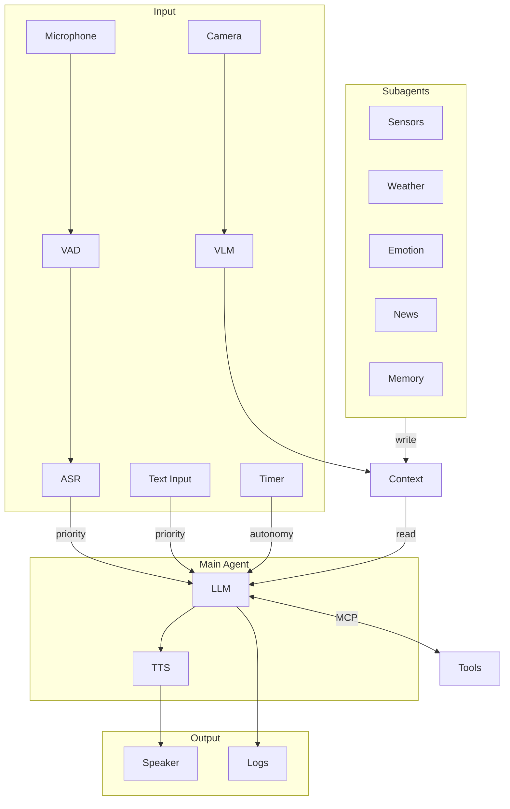

# GLaDOS Personality Core

> *"Наука — это не вопрос «почему». Это вопрос «а почему бы и нет»."  -  Кейв Джонсон*

Форк [dnhkng/GLaDOS](https://github.com/dnhkng/GLaDOS) с поддержкой **русского языка** — голосовой ИИ-ассистент в стиле GLaDOS из Portal. Саркастичный, пассивно-агрессивный искусственный интеллект, который видит через камеру, слышит через микрофон, говорит через динамик и осуждает вас соответственно.

## Что добавлено в этом форке

- **Русский TTS** — синтез речи на русском языке голосом GLaDOS через [TeraTTS](https://github.com/Tera2Space/TeraTTS) + [ruaccent](https://github.com/Den4ikAI/ruaccent) для корректной расстановки ударений
- **Русский конфиг** — готовый `configs/glados_config_ru.yaml` с русским системным промптом и few-shot примерами в стиле GLaDOS
- **Оптимизированная LLM-модель** — конфиг настроен на Qwen 2.5 7B, которая хорошо работает с русским языком (в отличие от llama3.2)
- **Ленивая загрузка ASR** — модель распознавания речи загружается только при первом включении, что ускоряет запуск
- **Улучшенная обработка ошибок** — ASR-ошибки логируются с полным traceback вместо молчаливого падения потока

## Быстрый старт

### 1. Установить Ollama и скачать модель

```bash
# Установить Ollama: https://github.com/ollama/ollama
ollama pull qwen2.5:7b
```

### 2. Клонировать и установить

```bash
git clone https://github.com/gotogrub/GLaDOS.git
cd GLaDOS
python scripts/install.py
uv pip install -e ".[cpu,ru]"
```

### 3. Скачать модели

```bash
uv run glados download
```

### 4. Запустить

```bash
uv run glados tui --config configs/glados_config_ru.yaml
```

## Режимы запуска

```bash
# Русская версия (TUI)
uv run glados tui --config configs/glados_config_ru.yaml

# Английская версия (оригинал)
uv run glados tui

# Голосовой режим (английский ASR)
uv run glados start

# Только текст
uv run glados start --input-mode text --config configs/glados_config_ru.yaml

# Озвучить фразу
uv run glados say "The cake is a lie"
```

## Конфигурация

Основные файлы конфигурации:
- `configs/glados_config.yaml` — английский (оригинал)
- `configs/glados_config_ru.yaml` — русский

### Голоса

В `voice` можно указать:

| Значение | Язык | Описание |
|----------|------|----------|
| `glados` | EN | Оригинальный голос GLaDOS |
| `glados_ru` | RU | Русский голос GLaDOS (TeraTTS) |
| `af_bella`, `am_adam`, ... | EN | Голоса Kokoro |

### Смена LLM

```yaml
llm_model: "qwen2.5:7b"      # хороший русский
# llm_model: "gemma-3:4b"     # быстрее, русский приемлемый
# llm_model: "llama3.2"       # только английский
```

Каталог моделей: [ollama.com/library](https://ollama.com/library)

### ASR (распознавание речи)

Встроенный ASR (Parakeet TDT) поддерживает **только английский**. В русском конфиге он запускается с задержкой — загружается при первом включении через `/asr on` в TUI или Command Palette (`Ctrl+P`).

### Кастомная личность

```yaml
personality_preprompt:
  - system: "Ты — саркастичный ИИ, который осуждает людей."
  - user: "Что думаешь о моём коде?"
  - assistant: "Я видела лучший вывод от генератора случайных чисел."
```

### MCP-серверы

```yaml
mcp_servers:
  - name: "system_info"
    transport: "stdio"
    command: "python"
    args: ["-m", "glados.mcp.system_info_server"]
```

Встроенные: `system_info`, `time_info`, `disk_info`, `network_info`, `process_info`, `power_info`, `memory`

Подробнее: [docs/mcp.md](/docs/mcp.md)

## Управление TUI

| Сочетание | Действие |
|-----------|----------|
| `Ctrl+P` | Палитра команд |
| `F1` | Помощь |
| `Ctrl+D` | Панель диалога |
| `Ctrl+L` | Панель логов |
| `Ctrl+S` | Панель статуса |
| `Ctrl+A` | Панель автономии |
| `Ctrl+U` | Панель очередей |
| `Ctrl+M` | Панель MCP |
| `Ctrl+I` | Переключить правые панели |
| `Ctrl+R` | Восстановить все панели |

## Архитектура



| Компонент | Технология | Назначение |
|-----------|------------|------------|
| ASR | Parakeet TDT (ONNX) | Распознавание речи (EN) |
| VAD | Silero VAD (ONNX) | Детекция голоса |
| TTS (EN) | Kokoro / GLaDOS | Синтез речи (английский) |
| TTS (RU) | TeraTTS + ruaccent | Синтез речи (русский) |
| Vision | FastVLM (ONNX) | Компьютерное зрение |
| LLM | OpenAI-compatible API | Рассуждение, инструменты |
| Tools | MCP Protocol | Расширяемость |
| Memory | MCP + Subagent | Долгосрочная память |
| Emotions | PAD + HEXACO | Эмоциональное состояние |

## Зависимости для русского языка

```bash
uv pip install -e ".[cpu,ru]"
```

Устанавливает:
- **TeraTTS** — VITS-модель для русского TTS (модель `TeraTTS/glados2-g2p-vits` скачивается автоматически с HuggingFace при первом запуске)
- **ruaccent** — расстановка ударений в русском тексте

## Устранение неполадок

**GLaDOS отвечает сама себе:**
Используйте наушники или микрофон с эхоподавлением. Или `interruptible: false`.

**Медленный запуск:**
ASR-модель загружается при старте (~600MB). В русском конфиге загрузка отложена до первого `/asr on`.

**TTS не работает (русский):**
Убедитесь что установлены зависимости: `uv pip install -e ".[cpu,ru]"`

**Windows DLL error:**
Установите [Visual C++ Redistributable](https://learn.microsoft.com/en-us/cpp/windows/latest-supported-vc-redist).

## Благодарности

- [dnhkng/GLaDOS](https://github.com/dnhkng/GLaDOS) — оригинальный проект
- [TeraTTS](https://github.com/Tera2Space/TeraTTS) — русский TTS
- [ruaccent](https://github.com/Den4ikAI/ruaccent) — акцентуация русского текста
- [KPEKEP/GLaDOS](https://github.com/KPEKEP/GLaDOS) — вдохновение для русской интеграции
- [Ollama](https://ollama.ai/) — локальный запуск LLM

## Лицензия

Оригинальная лицензия проекта. См. [LICENSE.txt](LICENSE.txt).
