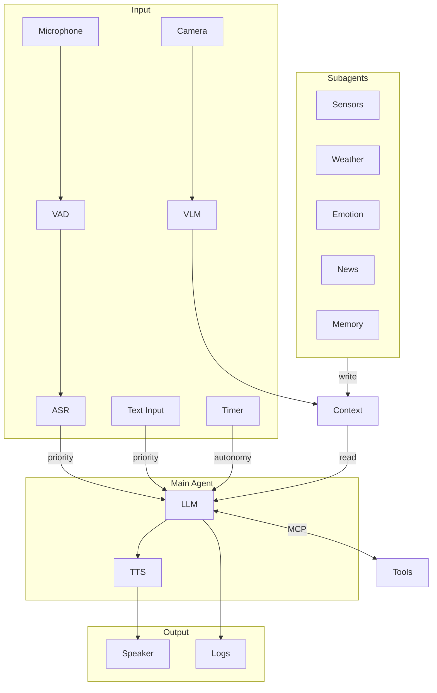
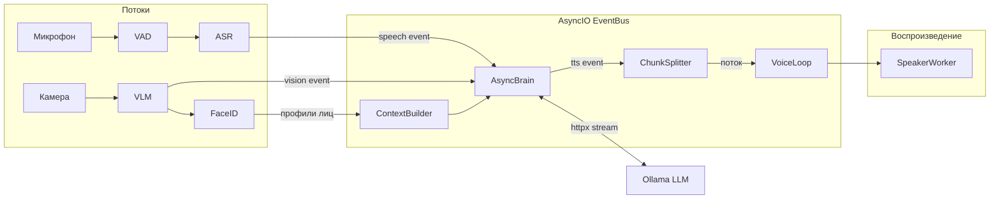

# GLaDOS Personality Core

> *"Наука — это не вопрос «почему». Это вопрос «а почему бы и нет»."  -  Кейв Джонсон*

[English version](README.md)

Форк [dnhkng/GLaDOS](https://github.com/dnhkng/GLaDOS) с поддержкой **русского языка** — голосовой ИИ-ассистент в стиле GLaDOS из Portal. Саркастичный, пассивно-агрессивный искусственный интеллект, который видит через камеру, слышит через микрофон, говорит через динамик и осуждает вас соответственно.

## Что добавлено в этом форке

- **Русский TTS** — синтез речи на русском языке голосом GLaDOS через [TeraTTS](https://github.com/Tera2Space/TeraTTS) + [ruaccent](https://github.com/Den4ikAI/ruaccent) для корректной расстановки ударений
- **Русский ASR** — распознавание речи на русском через [faster-whisper](https://github.com/SYSTRAN/faster-whisper)
- **Русский конфиг** — готовый `configs/glados_config_ru.yaml` с русским системным промптом и few-shot примерами в стиле GLaDOS
- **Умные прерывания** — `interrupt_keywords` в конфиге предотвращает самопрерывание GLaDOS; реагирует только на слова вроде «замолчи», «стоп»
- **Отключение tools** — `tools_enabled: false` позволяет использовать модели без function calling (например Gemma 3)
- **Сохранение кадров** — `save_frames: true` сохраняет снимки с камеры и описания VLM на диск
- **Проброс параметров LLM** — поле `llm_options` в конфиге для настройки Ollama (`num_ctx`, `num_thread` и др.)
- **Ленивая загрузка ASR** — модель распознавания речи загружается только при первом включении
- **Логирование в файл** — логи каждого запуска в `logs/YYYY-MM-DD_runNN.log` с полной DEBUG-детализацией
- **Облегчённый конфиг** — `configs/glados_config_ru_lite.yaml` для мини-ПК (qwen2.5:3b, CTC ASR, уменьшенное контекстное окно)

## Быстрый старт

### 1. Установить Ollama и скачать модель

```bash
# Установить Ollama: https://github.com/ollama/ollama
ollama pull gemma3:4b       # быстрая, без поддержки tools
# или
ollama pull qwen2.5:7b      # медленнее, поддерживает tools + хороший русский
```

### 2. Клонировать и установить

```bash
git clone https://github.com/gotogrub/GLaDOS.git
cd GLaDOS
python scripts/install.py
uv pip install -e ".[cpu,ru,tui]"
```

### 3. Скачать модели

```bash
uv run glados download
```

### 4. Запустить

```bash
uv run glados tui --config configs/glados_config_ru.yaml
```

## Режимы запуска

```bash
# Русская версия (TUI)
uv run glados tui --config configs/glados_config_ru.yaml

# Английская версия (оригинал)
uv run glados tui

# Голосовой режим (английский ASR)
uv run glados start

# Только текст
uv run glados start --input-mode text --config configs/glados_config_ru.yaml

# Озвучить фразу
uv run glados say "The cake is a lie"

# Режим робота (минимальный 5-поточный движок, без TUI)
uv run glados robot --config configs/robot_config.yaml
```

### Режим робота (async-движок)

Событийно-ориентированный async-движок для робототехники — без TUI, без MCP, только речь + зрение + LLM со стримингом TTS:

```bash
uv run glados robot --config configs/robot_config.yaml
# или
python -m glados robot --config configs/robot_config.yaml
```

Архитектура:
- **Async EventBus** — pub/sub в главном asyncio-цикле (события speech, vision, tts, tts_eos)
- **AsyncBrain** — стримит токены LLM, отправляет TTS-чанки на середине предложения (порог 4 слова) для низкой задержки
- **Thread-воркеры** — SpeechWorker, VisionWorker, SpeakerWorker с блокирующим I/O в daemon-потоках
- **VoiceLoop** — async-задача синтеза TTS, мост text→audio через `asyncio.to_thread`
- **Watchdog** — мониторинг потоков, логирование сбоев

Возможности:
- **Распознавание лиц** через SCRFD + ArcFace (ONNX) с профилями и описаниями для каждого лица
- **3 окна OpenCV** — живой поток камеры, анализируемые кадры с рамками лиц, текстовая панель VLM (кириллица через PIL)
- **Потоковый TTS** — речь начинается до завершения генерации полного предложения
- **Обрезка контекста** — хранит последние 10 пар сообщений для предотвращения роста TTFT
- **Логи по запускам** — `logs/YYYY-MM-DD_runNN.log` с уровнем DEBUG

#### Добавление лиц

```
faces/
  creator/
    photo1.jpg
    photo2.jpg
  alice/
    photo1.jpg
```

Фото индексируются при запуске. Настройте профили лиц в `robot_config.yaml`:

```yaml
face_names:
  creator:
    name: "Создатель"
    description: "Твой создатель. Молодой человек в очках. Обращайся уважительно, но в своём саркастичном стиле."
  alice:
    name: "Алиса"
    description: "Коллега. Любит котов."
```

Описание инжектируется в контекст LLM при распознавании лица, чтобы GLaDOS знала, *с кем* она разговаривает.

#### Дорожная карта

- **Фаза A** (готово): Критические фиксы — воспроизведение TTS, детекция FaceID, sd.wait()
- **Фаза B** (готово): Async-архитектура — EventBus, AsyncBrain, потоковый TTS, Watchdog
- **Фаза C** (план): PipelineMetrics, PulseAudio AEC, multiprocessing для CPU-задач
- **Фаза D** (план): Эмоциональное лицо на мониторе — теги эмоций LLM → fullscreen-картинки ("лицо" GLaDOS)
- **Фаза E** (план): Управление моторами через ToolExecutor (GPIO, serial), датчики препятствий
- **Фаза F** (план): Навигация (SLAM), планирование маршрута, автономное движение

## Конфигурация

Файлы конфигурации:
- `configs/glados_config.yaml` — английский (оригинал)
- `configs/glados_config_ru.yaml` — русский (полный функционал)
- `configs/glados_config_ru_lite.yaml` — русский (облегчённый, для мини-ПК)

### Голоса

В `voice` можно указать:

| Значение | Язык | Описание |
|----------|------|----------|
| `glados` | EN | Оригинальный голос GLaDOS |
| `glados_ru` | RU | Русский голос GLaDOS (TeraTTS) |
| `af_bella`, `am_adam`, ... | EN | Голоса Kokoro |

### Смена LLM

```yaml
llm_model: "gemma3:4b"        # быстрая, хороший русский (без tools)
# llm_model: "qwen2.5:7b"     # хороший русский + поддержка tools
# llm_model: "qwen2.5:3b"     # облегчённая
# llm_model: "llama3.2"       # только английский
```

Модели без поддержки tools требуют `tools_enabled: false` в конфиге.

Каталог моделей: [ollama.com/library](https://ollama.com/library)

### Оптимизация производительности LLM

Параметры Ollama можно задать прямо в конфиге:

```yaml
llm_options:
  num_ctx: 2048      # контекстное окно (меньше = быстрее)
  num_thread: 8      # потоки CPU (половина от общего числа — хороший вариант)
```

Для оптимальной работы Ollama на CPU настройте systemd-сервис:

```bash
sudo systemctl edit ollama.service
```

```ini
[Service]
Environment="OLLAMA_NUM_PARALLEL=1"
Environment="OLLAMA_MAX_LOADED_MODELS=1"
Environment="OLLAMA_FLASH_ATTENTION=1"
```

```bash
sudo systemctl daemon-reload && sudo systemctl restart ollama
```

### ASR (распознавание речи)

Три ASR-движка доступны через `asr_engine`:

| Движок | Язык | Размер | Скорость |
|--------|------|--------|----------|
| `whisper` | Мультиязычный (RU, EN, ...) | ~140MB | Средняя |
| `ctc` | Только английский | ~110MB | Быстрый |
| `tdt` | Только английский | ~600MB | Лучшая точность |

Русский конфиг использует `whisper` по умолчанию.

### Управление прерываниями

```yaml
interruptible: true
# Без keywords: любая речь прерывает GLaDOS (вызывает самопрерывание через динамик)
# С keywords: только определённые фразы прерывают
interrupt_keywords: ["замолчи", "заткнись", "стоп", "хватит", "тихо", "shut up", "stop"]
```

### Компьютерное зрение

```yaml
vision:
  camera_index: 0
  capture_interval_seconds: 5
  scene_change_threshold: 0.05
  max_tokens: 64
  save_frames: true              # сохранять снимки на диск
  save_frames_dir: "vision_frames"
  save_frames_max: 1000
```

При включении GLaDOS видит через камеру и добавляет описание сцены в контекст LLM. С включённой автономией реагирует на изменения сцены автоматически.

### Кастомная личность

```yaml
personality_preprompt:
  - system: "Ты — саркастичный ИИ, который осуждает людей."
  - user: "Что думаешь о моём коде?"
  - assistant: "Я видела лучший вывод от генератора случайных чисел."
```

### MCP-серверы

```yaml
mcp_servers:
  - name: "system_info"
    transport: "stdio"
    command: "python"
    args: ["-m", "glados.mcp.system_info_server"]
```

Встроенные: `system_info`, `time_info`, `disk_info`, `network_info`, `process_info`, `power_info`, `memory`

Требуется `tools_enabled: true` (по умолчанию). Подробнее: [docs/mcp.md](/docs/mcp.md)

## Управление TUI

| Сочетание | Действие |
|-----------|----------|
| `Ctrl+P` | Палитра команд |
| `F1` | Помощь |
| `Ctrl+D` | Панель диалога |
| `Ctrl+L` | Панель логов |
| `Ctrl+S` | Панель статуса |
| `Ctrl+A` | Панель автономии |
| `Ctrl+U` | Панель очередей |
| `Ctrl+M` | Панель MCP |
| `Ctrl+I` | Переключить правые панели |
| `Ctrl+R` | Восстановить все панели |

## Архитектура

### TUI-режим (полный агент)



### Режим робота (async-движок)



| Компонент | Технология | Назначение |
|-----------|------------|------------|
| ASR (EN) | Parakeet TDT/CTC (ONNX) | Распознавание речи (английский) |
| ASR (RU) | faster-whisper (CTranslate2) | Распознавание речи (мультиязычный) |
| VAD | Silero VAD (ONNX) | Детекция голоса |
| TTS (EN) | Kokoro / GLaDOS | Синтез речи (английский) |
| TTS (RU) | TeraTTS + ruaccent | Синтез речи (русский) |
| Vision | FastVLM (ONNX) | Компьютерное зрение |
| LLM | OpenAI-compatible API | Рассуждение, инструменты |
| Tools | MCP Protocol | Расширяемость |
| Memory | MCP + Subagent | Долгосрочная память |
| Emotions | PAD + HEXACO | Эмоциональное состояние |

## Зависимости для русского языка

```bash
uv pip install -e ".[cpu,ru,tui]"
```

Устанавливает:
- **TeraTTS** — VITS-модель для русского TTS (модель `TeraTTS/glados2-g2p-vits` скачивается автоматически с HuggingFace при первом запуске)
- **ruaccent** — расстановка ударений в русском тексте
- **faster-whisper** — Whisper ASR с поддержкой русского (модель скачивается при первом запуске)

## Устранение неполадок

**GLaDOS отвечает сама себе:**
Настройте `interrupt_keywords`, чтобы прерывание работало только по ключевым словам. Или используйте наушники / `interruptible: false`.

**Медленный запуск:**
ASR-модель загружается при старте. Используйте `asr_muted: true` для отложенной загрузки.

**Модель не поддерживает tools:**
Установите `tools_enabled: false` для моделей вроде Gemma 3.

**TTS не работает (русский):**
Убедитесь что установлены зависимости: `uv pip install -e ".[cpu,ru,tui]"`

**Логи:**
В режиме робота логи пишутся в `logs/YYYY-MM-DD_runNN.log` (уровень DEBUG). В TUI-режиме — в stderr.

**Windows DLL error:**
Установите [Visual C++ Redistributable](https://learn.microsoft.com/en-us/cpp/windows/latest-supported-vc-redist).

## Благодарности

- [dnhkng/GLaDOS](https://github.com/dnhkng/GLaDOS) — оригинальный проект
- [TeraTTS](https://github.com/Tera2Space/TeraTTS) — русский TTS
- [ruaccent](https://github.com/Den4ikAI/ruaccent) — акцентуация русского текста
- [faster-whisper](https://github.com/SYSTRAN/faster-whisper) — мультиязычный ASR
- [KPEKEP/GLaDOS](https://github.com/KPEKEP/GLaDOS) — вдохновение для русской интеграции
- [Ollama](https://ollama.ai/) — локальный запуск LLM

## Лицензия

Оригинальная лицензия проекта. См. [LICENSE.txt](LICENSE.txt).
